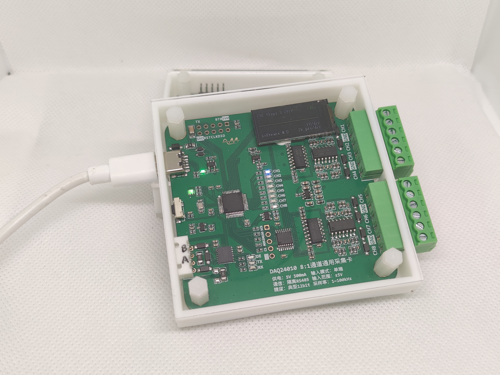
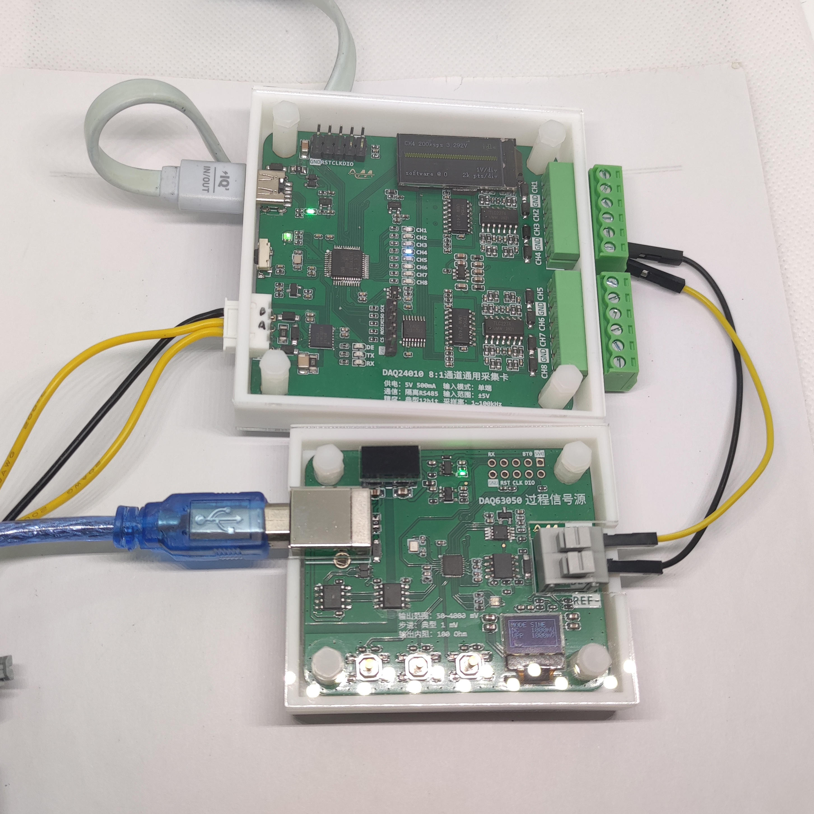

# DAQ24010 — 8 通道通用采集卡

> Octo-Channel Universal DAQ Card

[](https://opensource.org/licenses/MIT)

---

## 简介 | Introduction

DAQ24010 是一款基于 **AT32F415** 的 8:1 通道通用采集卡，设计采集范围 ±5 V，前端搭配 12-bit 8 通道 ADC XADC128S022，支持通过 RS485 以 [Linux CLI 风味命令](https://github.com/YaoheWangEC/linux-cli-style-command-driver-framework) 控制采集，也可通过板载按键与 1.8" LCD 本地操作、显示波形。

该采集卡采样率支持 1 k ~ 200 k SPS，提供软件 / 电平 / 斜率触发方式，内置 TL431 基准实时反推 AVDD 用于电压换算。设备同时提供 EEPROM 供上位机持久化通道校正参数。

DAQ24010 is an 8:1 channel universal DAQ card based on the **AT32F415**, designed for a ±5 V acquisition range. With a 12-bit 8-channel ADC XADC128S022 on the front end, it is controlled over RS485 using [Linux CLI-style commands](https://github.com/YaoheWangEC/linux-cli-style-command-driver-framework), and can also be operated locally via on-board keys with waveform display on a 1.8" LCD.

The card supports 1 k ~ 200 k SPS and software / level / slope triggers, and features an on-board TL431 reference that derives AVDD at runtime for voltage conversion. An EEPROM lets the host persist per-channel calibration.



> 视频演示：*待补充* ｜ 立创开源：*待补充*

## 主要参数 | Specifications

| 参数 | 值 | 备注 |
| ------ | ------------- | ----------------------- |
| 供电 | USB 5 V，max. 500 mA | — |
| 输入通道 | 8 路单端 | 逻辑通道 1~8，可命令切换 |
| 输入范围 | 设计 ±5 V | 极限约 ±6.6 V |
| 采样率 | 1 k ~ 200 k SPS | 原始 100 k / 120 k / 200 k，N 档箱式平均降采样 |
| 触发 | 软件 / 电平 / 斜率 | `software`、`level±`、`slope±`，基于降采样输出 |
| 通信接口 | RS485 | 115200 8N1 |

---

## 快速上手 | Getting Started



> 图中为 DAQ24010（待测）与 DAQ63050（信号源）联合测试场景。

### 1. 接线 | Wiring

| 接口名 | 接口形态 | 功能 | 备注 |
| --- | --- | --- | --- |
| 模拟输入 | 3.96 mm 间距插拔式接线端子 | 8 通道电压输入 | 单端，范围约 ±6.6 V |
| RS485 | XH254 4P | 控制 + 数据 | 115200 8N1，A/B 差分 |
| 供电 | USB Type-C | 电源输入 | 5 V，max. 500 mA |

### 2. 上电 | Power On

接通电源后，LCD 显示自检画面（设备名 / 产品名 / UID / `Hello World`），随后进入状态界面。上电约 1 s 后自动执行一次按键触发型采样并显示一次波形。RGB LED 指示采集状态：**空闲-绿 / 等待触发-蓝 / 采集中-红**。

### 3. 本地操作 | Local Control

| 按键 | 短按 | 长按 |
| --- | --- | --- |
| KEY | 软件触发一次采集并显示波形 | 切换下一通道（强制停止当前采集并重采） |

- 波形区：160 列 min/max 包络（前 8000 点，每列 50 点），网格为时间 2k pts/div、电压 1V/div。
- 状态栏显示：当前通道 / 采样率 / AVDD / 触发模式与阈值 / 采集状态。

### 4. RS485 控制 | RS485 Control

串口参数：**115200 bps, 8 data bits, 1 stop bit, no parity**

上电后发送 `lscmd` 可列出所有命令。DAQ24010 采用 [Linux CLI 风格](https://github.com/YaoheWangEC/linux-cli-style-command-driver-framework) 的 ASCII 文本协议，命令以 `\r\n` 结束，响应同样以 `\r\n` 结束，一问一答。

> 采样码值为 12-bit（`adc read` 以 4 字符紧凑 hex 回传，无分隔）。配置类命令（`status channel/rate/trigger`）仅允许在 **IDLE** 状态下执行，否则返回 `ERR: busy`。

#### 命令参考 | Command Reference

**`lscmd`** — 列出所有已注册命令

| 参数 | 说明 |
| --- | --- |
| `-h`, `--help` | 显示帮助 |

```
> lscmd
Supported commands:
  lscmd
  echo
  device
  eeprom
  reboot
  status
  adc
```

**`echo`** — 回显参数，用于测试通信链路

| 参数 | 说明 |
| --- | --- |
| `<text>` | 任意文本，多参数以空格拼接 |

```
> echo hello world
hello world
```

**`device`** — 读取设备名称与 MCU 96-bit 唯一 ID

无参数。

```
> device
Name  : DAQ24010 octo-channel-universal-daq
UID   : 12345678ABCDEF0012345678
```

**`reboot`** — 强制复位（拉低 NRST）

无参数。执行成功设备立即复位，无回包。

**`eeprom`** — 读写 AT24C02（256 B）

| 参数 | 说明 |
| --- | --- |
| `read <addr> [len]` | 读 `len` 字节（默认 1，上限 16），`addr+len ≤ 256` |
| `write <addr> <hex>` | 写紧凑 hex（偶数长度，上限 4 字节） |

```
> eeprom read 0 4
3F800000
> eeprom write 0 3F800000
OK
```

**`status`** — 查询或修改运行配置（修改仅 IDLE）

| 参数 | 说明 |
| --- | --- |
| *(无)* | 全量展示 tick/channel/raw_rate/dec_rate/trigger/state/avdd |
| `<field>` | 单项查询：`tick channel raw_rate rate trigger state avdd` |
| `channel <1..8>` | 设置逻辑通道 |
| `rate <rate>` | 设置降采样率（1000/2000/3000/4000/5000/6000/8000/10000/20000/30000/40000/50000/60000/100000/120000/200000） |
| `trigger <mode> [thr]` | 设置触发（`software level+ level- slope+ slope-`）与阈值码字 |

```
> status
tick     : 12345
channel  : 1
raw_rate : 200000
dec_rate : 8000
trigger  : software @ 0
state    : idle
avdd     : 3.291
> status channel 2
channel  : 2
> status rate 10000
raw_rate : 200000
dec_rate : 10000
```

**`adc`** — 采集控制与数据流

| 参数 | 说明 |
| --- | --- |
| *(无)* | 配置全量展示 + ringbuf 信息（buf_cnt/buf_cap/buf_full/overflow） |
| `status` | 仅返回采集状态（便于自动化读取） |
| `start` / `stop` | 开始 / 强制停止采集（stop 保留 ringbuf） |
| `rest` | 仅返回剩余样本数（便于轮询） |
| `read [n]` | 读出至多 n 个样本（默认/上限 128），4 字符紧凑 hex；不足则返回已有数据 |

```
> adc start
OK
> adc rest
1024
> adc read 128
0ABC0ABD0ABE...   # 每样本 4 hex 字符
```

> **采集模型**：设备采样写入 8192 点环形缓冲，**写满即自动停止**（不循环覆盖）。上位机需轮询 `adc rest` / `adc read` 排空。

---

## Python 驱动 | Python Driver

`software/driver/` 下提供纯驱动库 `daq24010.py`，封装上述 RS485 命令协议，内置电压换算、按通道校正与 EEPROM 持久化。

### 依赖 | Requirements

- Python 3.10+
- `pyserial`、`numpy`（自检绘图另需 `matplotlib`）

```
pip install pyserial numpy matplotlib
```

### 快速开始 | Quick Start

```python
from daq24010 import DAQ24010

with DAQ24010() as dev:                 # 自动嗅探串口（也可 DAQ24010('COM5')）
    print(dev.get_device_name(), dev.get_uid())

    dev.set_channel(1)
    dev.set_rate(2000)
    dev.set_trigger('level+', 0.0)      # 0V 电平上升沿触发（阈值单位: V）
    v = dev.capture(2000, timeout=5.0)  # 一键采集 2000 点, 返回电压 np.ndarray

# with 退出时 close(): 默认发 reboot 复位设备
```

### API 速查 | API Overview

| 区域 | 方法 |
| --- | --- |
| 生命周期 | `__init__(port=None, load_calib=True)` / `close(reboot=True)` / `with` |
| 设备信息 | `get_device_name()` / `get_uid()` |
| 状态查询 | `get_avdd()` / `get_status()` |
| 配置（仅 IDLE） | `set_channel`/`get_channel`、`set_rate`/`get_rate`、`set_trigger`/`get_trigger` |
| 采集控制 | `start` / `stop` / `get_state` / `get_acq_info` / `remaining` |
| 数据面 | `stream_read(n=128)` / `capture(n, timeout=5.0)` |
| 持久化 | `eeprom_read(addr, length)` / `eeprom_write(addr, data)` |
| 其他 | `reboot()` |

> 驱动对外以 **V** 为单位收发，内部换算为 ADC 码值。电压换算与校正、EEPROM 布局、采集吞吐等详细说明见 [`software/driver/README.md`](software/driver/README.md)。

---

## 许可证 | License

本项目由不同许可的组件构成：

- **应用代码**（`software/daq2401x-octo-channel-daq-f415cbt7/project/MDK_V5/daq2401x/` 下用户编写的采集逻辑、命令框架、LCD / 按键驱动等，以及 `software/driver/` 的 Python 驱动）以 [MIT License](LICENSE) 发布，版权归 [YaoheWangEC](https://github.com/YaoheWangEC)。
- **Artery BSP**（`libraries/drivers/`、`project/src/` 中 `wk_*.c`、`main.c` 模板等）版权归 Artery Technology，允许在与 Artery MCU 配合使用的场合复制和分发。
- **CMSIS-Core** 版权归 Arm Limited，遵循 Apache License 2.0。

This project consists of components under different licenses:

- **Application code** (user-written acquisition logic, command framework, LCD / key drivers under `software/daq2401x-octo-channel-daq-f415cbt7/project/MDK_V5/daq2401x/`, and the Python driver under `software/driver/`) is released under the [MIT License](LICENSE), copyright [YaoheWangEC](https://github.com/YaoheWangEC).
- **Artery BSP** (`libraries/drivers/`, `project/src/` `wk_*.c`, `main.c` template, etc.) is copyright Artery Technology, with permission to copy and distribute for use with Artery MCUs.
- **CMSIS-Core** is copyright Arm Limited under Apache License 2.0.

## 资助致谢 | Sponsorship Acknowledgment

感谢梁总的百亿 Token 补贴政策，使本项目的 AI 辅助开发成本趋近于零。

## 致谢 | Acknowledgements

本项目由 [YaoheWangEC](https://github.com/YaoheWangEC) 设计开发。在项目开发与开源文档整理过程中，DeepSeek 提供了大量的辅助，包括代码编写、设计建议和文档组织。

## 免责声明 | Disclaimer

本项目由 DeepSeek 辅助编写，可能存在纰漏。本项目仅供学习研究，未经工业场景充分验证。使用者应自行评估安全风险，作者与 DeepSeek 不对因使用本项目及其文档所造成的任何损失承担责任。

This documentation was drafted with the assistance of DeepSeek and may contain errors. This project is provided for educational and research purposes only and has not been fully validated for industrial environments. Users should evaluate safety risks on their own. The author and DeepSeek assume no liability for any damages arising from the use of this project or its documentation.

---
